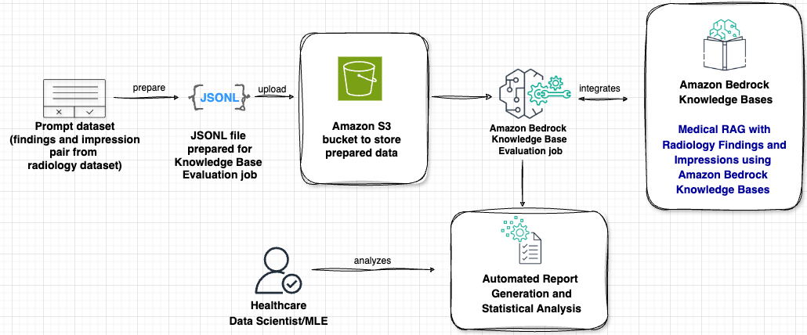

# Evaluating Healthcare Generative AI Applications Using LLM-as-a-Judge on AWS

This repository demonstrates the evaluation of healthcare generative AI applications using LLM-as-a-Judge (LLMaaJ) methodology on AWS Bedrock. The project focuses on semantic evaluation of medical GenAI applications, specifically for radiology report summarization.

## Overview



The project showcases:
- Data processing for medical RAG evaluation
- Implementation of LLM-as-a-Judge evaluation framework
- Integration with AWS Bedrock Knowledge Bases
- Evaluation metrics

## Repository Contents

The repository contains two main Jupyter notebooks:

1. `0_data_processing.ipynb`
   - Data preparation and transformation
   - Converting medical reports to JSONL format
   - Structuring data for RAG evaluation

2. `1_healthcare-llmaaj-evaluation.ipynb`
   - RAG evaluation setup
   - Implementation of LLM-as-a-Judge methodology

## Prerequisites

- AWS Account with Bedrock access
- Python 3.8+
- Required AWS permissions:
  - Amazon Bedrock
  - Amazon S3
  - IAM roles
- MIMIC-CXR dataset access (requires data use agreement)

## Required Python Packages

```
boto3
pandas
numpy
matplotlib
jupyter
```

## Dataset

The code works with:
- MIMIC Chest X-ray (MIMIC-CXR) Database v2.0.0
- Test datasets:
  - Beth Israel (1k reports)
  - Indiana University (1k reports)

## Evaluation Metrics

The framework evaluates five key aspects:
1. **Correctness**: Clinical accuracy assessment
2. **Completeness**: Coverage of medical information
3. **Helpfulness**: Clinical utility
4. **Logical Coherence**: Medical reasoning flow
5. **Faithfulness**: Alignment with source material

## Usage

1. First, run the data processing notebook:
```bash
jupyter notebook 0_data_processing.ipynb
```

2. Then, execute the evaluation notebook:
```bash
jupyter notebook 1_healthcare-llmaaj-evaluation.ipynb
```

Ensure you update the configuration variables in both notebooks with your AWS credentials and resource identifiers.

## License

This project is licensed under the MIT License - see the [LICENSE.md](LICENSE.md) file for details.

## Citation

If you use this code in your research, please cite:

```bibtex
@misc{healthcare-genai-evaluation,
  author = {Adewale Akinfaderin; Priya Padate; Ekta Walia Bhullar},
  title = {Automated Evaluation of Healthcare Generative AI Applications Using LLM-as-a-Judge},
  year = {2024},
  publisher = {GitHub},
  url = {https://github.com/aws-samples/healthcare-genai-evaluation}
}
```

## Acknowledgments
Special thanks to Adewale Akinfaderin, Priya Padate, and Ekta Walia Bhullar and for their contributions to this project and sharing their expertise in this field.

## License
This library is licensed under the MIT-0 License. See the LICENSE file.
